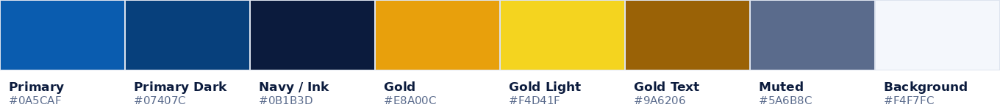

# PRD — Frontend Website Luhas
### Tour & Travel Umroh · Company Profile + Lead Generation

| | |
|---|---|
| **Produk** | Website Luhas (luhas.co.id) |
| **Tipe** | Company profile + katalog paket + lead form (tanpa transaksi online) |
| **Versi dokumen** | 1.1 |
| **Tanggal** | 29 Agustus 2026 (rev. 1.1) |
| **Status** | Direvisi setelah jawaban stakeholder |
| **Bahasa konten** | Bahasa Indonesia (bahasa utama, satu-satunya bahasa di Rilis 1) |
| **Pemilik dokumen** | Product Owner Luhas |
| **Stakeholder** | Marketing, Sales/CS, Operasional Umroh, Engineering, Desain |

---

## 1. Ringkasan Eksekutif

Luhas adalah biro perjalanan umroh yang menyasar segmen **muslim muda usia 25–40 tahun** — generasi yang riset di TikTok dan Instagram, membandingkan harga di ponsel, sensitif terhadap kejelasan biaya, dan lebih memilih chat daripada telepon.

Website ini **bukan mesin transaksi**. Fungsinya adalah mesin kepercayaan dan mesin lead: mengubah traffic dari iklan, konten sosial, dan pencarian organik menjadi percakapan WhatsApp yang berkualitas dengan tim sales.

Keputusan produk paling penting dalam PRD ini:

1. **Mobile-first mutlak.** Diasumsikan >85% traffic dari ponsel, mayoritas dari in-app browser TikTok/Instagram yang lambat.
2. **Harga transparan sejak awal.** Harga mulai + simulasi pembayaran bertahap tampil di kartu paket, bukan disembunyikan di balik "hubungi kami".
3. **WhatsApp sebagai konversi utama.** Setiap CTA berujung ke WhatsApp dengan pesan terisi otomatis (paket + tanggal + sumber traffic).
4. **Konten sosial adalah bagian dari produk**, bukan tempelan — feed Instagram/TikTok dan video testimoni jamaah tampil di halaman utama dan halaman paket.
5. **Bahasa Indonesia sepenuhnya.** Seluruh konten, label antarmuka, pesan error, dan metadata berbahasa Indonesia dengan ejaan istilah yang dibakukan — tanpa satu pun teks Inggris yang terlihat pengunjung (bab 10).

---

## 2. Latar Belakang & Pernyataan Masalah

### 2.1 Kondisi saat ini
Calon jamaah muda memulai perjalanannya dari konten sosial, bukan dari website. Website travel umroh yang ada umumnya:

- Menyembunyikan harga sehingga pengunjung mundur sebelum kontak.
- Berat, penuh slider dan animasi, gagal dimuat di koneksi seluler.
- Terlihat generik dan tidak meyakinkan — sulit membedakan travel legal dari travel bermasalah.
- Tidak menjawab kekhawatiran nyata: "apakah izin PPIU-nya asli?", "kalau saya belum punya uang penuh bagaimana?", "berangkatnya benar-benar jadi tidak?".

### 2.2 Masalah yang diselesaikan

| # | Masalah | Dampak | Solusi di produk ini |
|---|---|---|---|
| P1 | Harga tidak transparan | Bounce tinggi, lead tidak berkualitas | Harga mulai + rincian per tipe kamar + kalkulator pembayaran bertahap |
| P2 | Kepercayaan rendah terhadap travel umroh | Calon jamaah ragu, butuh waktu lama memutuskan | Blok legalitas (nomor SK PPIU Kemenag), testimoni video, galeri keberangkatan nyata |
| P3 | Traffic sosial tidak terkonversi | Biaya iklan tinggi, ROAS rendah | Landing page cepat, CTA WhatsApp lengket, pesan prefilled + tracking sumber |
| P4 | Perbandingan paket sulit | Pengunjung membuka banyak tab, lalu pergi | Filter, banding paket berdampingan, badge "sisa seat" |
| P5 | Website tidak ditemukan di Google | Ketergantungan penuh pada iklan berbayar | SSG/ISR, schema markup, blog panduan umroh |

---

## 3. Tujuan & Metrik Sukses

### 3.1 Tujuan produk

- **G1** — Menjadi sumber lead utama Luhas (menggeser DM Instagram sebagai kanal masuk).
- **G2** — Membangun persepsi Luhas sebagai travel umroh yang modern, transparan, dan legal.
- **G3** — Menurunkan beban tim CS dengan menjawab pertanyaan berulang di website.
- **G4** — Membangun aset organik jangka panjang lewat konten SEO.

### 3.2 KPI dan target (3 bulan setelah rilis)

| KPI | Baseline | Target | Cara ukur |
|---|---|---|---|
| Conversion rate ke WhatsApp | — | ≥ 6% dari sesi | GA4 event `wa_click` / sesi |
| Lead form terkirim | — | ≥ 150 / bulan | GA4 event `lead_submit` |
| Lead berkualitas (siap DP) | — | ≥ 25% dari lead | Tagging manual di CRM/spreadsheet CS |
| Bounce rate mobile | — | ≤ 45% | GA4 |
| LCP mobile (p75) | — | ≤ 2,5 detik | Lighthouse CI + CrUX |
| Halaman paket masuk 10 besar Google | 0 | ≥ 5 kata kunci | Google Search Console |
| Waktu rata-rata di halaman paket | — | ≥ 90 detik | GA4 |

### 3.3 Anti-goal (yang secara sadar TIDAK dikejar)

- Bukan mengejar jumlah lead sebanyak-banyaknya bila kualitas turun.
- Bukan menambah animasi/efek visual yang mengorbankan kecepatan.
- Tidak menampilkan harga palsu (harga "mulai dari" yang tidak pernah tersedia).

---

## 4. Target Pengguna

### 4.1 Persona utama — "Rizky, 29, Karyawan Swasta"
Menikah, satu anak, gaji bulanan tetap, tinggal di kota besar. Menemukan Luhas dari video TikTok soal biaya umroh. Membuka website sambil rebahan di ponsel. Ingin tahu: berapa total yang harus disiapkan, bisa dicicil berapa lama, hotelnya berapa jauh dari Masjidil Haram, dan apakah travel ini resmi. Tidak mau menelepon; akan chat WhatsApp kalau tombolnya jelas.

**Kebutuhan:** harga jujur, simulasi pembayaran bertahap, bukti legalitas, jawaban cepat.
**Penghalang:** takut tertipu, takut komitmen finansial, tidak punya waktu membaca panjang.

### 4.2 Persona sekunder — "Nadia, 33, Wirausaha"
Ingin memberangkatkan orang tua. Membandingkan 3–4 travel. Sangat memperhatikan fasilitas (hotel bintang berapa, jarak, maskapai langsung atau transit) dan pendampingan lansia. Membaca detail itinerary sampai habis.

**Kebutuhan:** perbandingan paket, detail fasilitas, kebijakan pendampingan lansia.

### 4.3 Persona tersier — "Ustadz Fauzi, 45, Koordinator Jamaah"
Mengumpulkan rombongan dari majelis taklimnya. Butuh brosur PDF yang bisa disebar dan skema keberangkatan grup.

**Kebutuhan:** unduh brosur, kontak khusus grup, ketersediaan seat.

---

## 5. Ruang Lingkup

### 5.1 Termasuk (In Scope — Rilis 1)

- Beranda (landing utama)
- Daftar paket umroh dengan filter dan pengurutan
- Halaman detail paket (satu halaman per paket, SEO-friendly)
- Banding paket (bandingkan hingga 3 paket)
- Kalkulator simulasi pembayaran bertahap
- Tentang Luhas (legalitas, tim, pembimbing ibadah)
- Galeri & testimoni (foto + video)
- Blog / Panduan Umroh
- FAQ
- Kontak & lokasi kantor
- Form pendaftaran minat (lead form) + WhatsApp deep link
- Halaman kebijakan privasi & syarat ketentuan
- CMS untuk tim marketing mengelola paket, blog, testimoni, dan galeri

### 5.2 Tidak Termasuk (Out of Scope — Rilis 1)

- Pembayaran online / payment gateway (dikonfirmasi tidak masuk Rilis 2 juga — lihat bab 21)
- Login jamaah / portal dokumen
- Dashboard agen & sistem komisi
- Sistem manajemen keberangkatan internal (back office operasional)
- Bahasa selain Bahasa Indonesia. Seluruh konten dan antarmuka berbahasa Indonesia; struktur i18n disiapkan tetapi tidak diaktifkan (lihat bab 10)
- Aplikasi mobile native

### 5.3 Asumsi

- Data paket disediakan tim operasional dalam format terstruktur dan diperbarui minimal 2 minggu sekali.
- Nomor WhatsApp bisnis (WhatsApp Business API atau minimal WA Business) tersedia dan dijaga tim CS jam kerja.
- Foto keberangkatan asli tersedia (bukan stok) minimal 60 foto dan 5 video testimoni.
- Legalitas PPIU aktif dan nomor SK boleh dipublikasikan.

---

## 6. Arsitektur Informasi (Sitemap)

```
/                              Beranda
/paket                         Daftar semua paket + filter
/paket/[slug]                  Detail paket
/paket/banding                 Banding paket (hingga 3)
/simulasi-pembayaran           Kalkulator pembayaran bertahap
/tentang                       Tentang Luhas + legalitas + tim
/pembimbing                    Profil pembimbing ibadah / muthawif
/galeri                        Galeri foto & video keberangkatan
/testimoni                     Testimoni jamaah
/panduan                       Blog / artikel panduan umroh
/panduan/[slug]                Artikel
/faq                           Pertanyaan yang sering diajukan
/kontak                        Kontak, peta kantor, jam operasional
/daftar                        Form pendaftaran minat
/kebijakan-privasi             Kebijakan privasi
/syarat-ketentuan              Syarat & ketentuan
/terima-kasih                  Halaman konfirmasi setelah submit (untuk tracking konversi)
```

**Navigasi utama (maks. 5 item):** Paket · Simulasi Pembayaran · Panduan · Testimoni · Tentang
**CTA tetap di header:** tombol "Chat Sekarang" (WhatsApp)
**Footer:** legalitas, kontak, sosial media, sitemap ringkas, kebijakan.

---

## 7. Spesifikasi Halaman

### 7.1 Beranda (`/`)

Urutan blok dari atas ke bawah — urutan ini disengaja mengikuti urutan pertanyaan di kepala pengunjung.

| # | Blok | Isi | Kriteria penerimaan |
|---|---|---|---|
| 1 | Hero | Headline nilai jual + subheadline + harga mulai + 2 CTA ("Lihat Paket", "Chat Sekarang") + foto/video jamaah asli | LCP element = gambar hero, `priority`, format AVIF/WebP, tampil penuh tanpa scroll di layar 360×640 |
| 2 | Trust bar | Nomor SK PPIU Kemenag, jumlah jamaah diberangkatkan, tahun berdiri, rating Google | Nomor SK dapat diklik menuju halaman verifikasi Kemenag |
| 3 | Paket unggulan | 3–4 kartu paket dengan badge (Promo / Best Seller / Sisa 5 Seat) | Kartu menampilkan harga, durasi, tanggal berangkat, hotel + jarak |
| 4 | Kenapa Luhas | 4 poin pembeda, ikon + kalimat pendek | Tidak lebih dari 15 kata per poin |
| 5 | Simulasi pembayaran mini | Slider harga + jumlah kali bayar → perkiraan bayar per bulan, tautan ke kalkulator penuh | Hasil berubah real-time tanpa reload |
| 6 | Testimoni video | Carousel 3–5 video pendek (format 9:16, seperti Reels) | Video lazy-load, poster image, tidak autoplay dengan suara |
| 7 | Feed sosial | Grid 6 post Instagram/TikTok terbaru | Gagal memuat feed tidak merusak layout (graceful degradation) |
| 8 | Alur pendaftaran | 4 langkah: Konsultasi → Pilih Paket → DP → Berangkat | Visual horizontal di desktop, vertikal di mobile |
| 9 | Artikel terbaru | 3 artikel panduan | — |
| 10 | FAQ ringkas | 5 pertanyaan teratas + tautan ke FAQ penuh | Accordion, ter-markup FAQPage schema |
| 11 | CTA penutup | Blok kontras dengan tombol WhatsApp | — |

### 7.2 Daftar Paket (`/paket`)

> **Catatan skala (Rilis 1):** hanya **7 paket aktif** saat rilis. Filter yang terlalu banyak pada katalog sekecil ini justru menambah beban kognitif — pengunjung bisa melihat seluruh katalog dalam satu layar gulir. Karena itu filter dipangkas dan paginasi ditiadakan.

**Filter Rilis 1 (3 saja, dapat digabung, tercermin di URL query agar bisa dibagikan):**

- Kategori: Hemat · Reguler · Plus Turki · Plus Dubai · Ramadhan · VIP (hanya kategori yang benar-benar terisi yang ditampilkan)
- Bulan keberangkatan
- Rentang harga (slider)

**Filter cadangan (aktifkan bila katalog melewati ±15 paket):** durasi, kota keberangkatan, maskapai, bintang hotel Makkah. Field-nya sudah ada di model konten, jadi pengaktifan nanti hanya soal menampilkan kontrol UI.

**Pengurutan:** Harga terendah · Keberangkatan terdekat · Paling populer

**Kartu paket wajib memuat:** nama paket, foto, harga mulai (per orang, tipe quad), durasi, tanggal keberangkatan terdekat, maskapai, hotel Makkah + jarak dalam meter, badge sisa seat, tombol "Detail" dan "Tanya via WA", checkbox "Bandingkan".

**Kriteria penerimaan:**

- Filter tidak me-reload halaman penuh; URL tetap dapat di-bookmark.
- Menampilkan skeleton saat memuat, bukan layar kosong.
- Kondisi kosong ("Tidak ada paket sesuai filter") menyertakan tombol reset dan saran paket terdekat.
- **Tanpa paginasi di Rilis 1** — seluruh 7 paket dirender sekaligus. Paginasi baru diperkenalkan bila katalog melewati 12 paket.
- Karena katalog kecil, halaman ini di-render statis penuh (SSG) tanpa pemuatan bertahap.

### 7.3 Detail Paket (`/paket/[slug]`)

Halaman terpenting untuk konversi dan SEO.

**Struktur:**

1. Header: nama paket, badge, harga per tipe kamar (Quad / Triple / Double) dalam tabel, tanggal berangkat, sisa seat, CTA ganda (WA + Daftar).
2. Galeri foto paket (hotel, maskapai, dokumentasi rombongan sebelumnya).
3. Ringkasan cepat: durasi, kota berangkat, maskapai, hotel Makkah (nama, bintang, jarak), hotel Madinah, pembimbing.
4. Simulasi pembayaran bertahap khusus paket ini (uang muka + jumlah kali bayar → perkiraan per bulan).
5. Itinerary harian (accordion per hari).
6. Fasilitas: dua kolom "Sudah termasuk" vs "Belum termasuk" — eksplisit, tanpa ambiguitas.
7. Syarat & dokumen yang harus disiapkan (paspor, vaksin meningitis, dll.).
8. Kebijakan pembayaran & pembatalan.
9. Testimoni jamaah paket serupa.
10. Paket lain yang mirip.
11. Sticky bottom bar di mobile: harga + tombol "Chat Sekarang".

**Kriteria penerimaan:**

- Sticky CTA muncul setelah scroll melewati hero, tidak menutupi konten penting.
- Pesan WhatsApp prefilled: `Assalamualaikum, saya tertarik dengan paket {nama_paket} keberangkatan {tanggal}. Mohon informasinya.`
- Structured data `Product` + `Offer` + `AggregateRating` valid di Rich Results Test.
- Brosur PDF paket dapat diunduh (event `brochure_download` terekam).

### 7.4 Banding Paket (`/paket/banding`)
Tabel berdampingan hingga 3 paket, baris: harga per tipe kamar, durasi, maskapai, hotel + jarak, fasilitas termasuk, sisa seat. Perbedaan disorot secara visual. Di mobile menjadi tabel yang dapat digeser horizontal dengan kolom nama terkunci.

### 7.5 Simulasi Pembayaran Bertahap (`/simulasi-pembayaran`)
Input: harga paket (pilih paket atau isi manual), uang muka (nominal atau %), jumlah kali bayar (3/6/9/12). Output: perkiraan pembayaran per bulan, total, dan tanggal pelunasan (paling lambat H-40 sebelum berangkat).

**Wajib — dan ini bukan formalitas.** Skema cicilan Luhas belum ditetapkan (lihat bab 21, butir 2). Selama status itu belum jelas, halaman ini **tidak boleh** memakai kata "kredit", "pembiayaan", "bunga", "tenor", atau "cicilan syariah", karena istilah-istilah tersebut merujuk pada produk jasa keuangan yang tunduk pada aturan OJK. Yang dipakai adalah bahasa **pembayaran bertahap**:

- Judul halaman: "Simulasi Pembayaran Bertahap", bukan "Simulasi Cicilan".
- Label input: "Uang muka", "Jumlah kali bayar" (bukan "tenor").
- Disclaimer permanen di atas hasil: *"Ini simulasi pembagian pembayaran internal Luhas, bukan produk pembiayaan atau kredit dari lembaga keuangan. Tidak ada bunga maupun biaya tambahan. Angka final dikonfirmasi tim kami."*
- Tidak ada angka bunga, biaya admin, atau denda yang ditampilkan di mana pun.

Tombol "Konsultasi skema ini via WA" mengirim ringkasan simulasi ke chat. Begitu skema resmi ditetapkan, teks di halaman ini wajib ditinjau ulang bersama tim legal sebelum diubah.

### 7.6 Tentang Luhas (`/tentang`)
Cerita singkat, visi, legalitas (SK PPIU, NIB, akta), foto kantor asli, tim inti dengan foto dan peran, jumlah jamaah per tahun. Tanpa foto stok.

### 7.7 Galeri & Testimoni
Galeri: grid masonry, filter per keberangkatan/tahun, lightbox. Testimoni: kartu berisi nama, kota, paket yang diambil, foto, kutipan; video testimoni format vertikal. Testimoni wajib atas izin jamaah.

### 7.8 Panduan / Blog (`/panduan`)
Kategori: Persiapan · Biaya · Ibadah · Tips Perjalanan · Dokumen. Seluruh judul dan slug artikel berbahasa Indonesia. Halaman artikel dengan daftar isi, estimasi baca, penulis, tanggal, CTA paket di tengah dan akhir artikel, artikel terkait.

### 7.9 FAQ (`/faq`)
Minimal 25 pertanyaan, dikelompokkan: Biaya & Pembayaran · Dokumen · Keberangkatan · Selama di Tanah Suci · Kebijakan. Accordion + pencarian dalam halaman + FAQPage schema.

### 7.10 Kontak (`/kontak`)
Alamat, peta (embed ringan yang dimuat setelah interaksi, bukan iframe otomatis), jam operasional, form pesan singkat.

**Nomor WhatsApp: +62 851-3572-0948 — satu nomor untuk semua kebutuhan.** Karena tidak ada pemisahan per divisi, seluruh CTA di website mengarah ke nomor yang sama; yang membedakan konteks percakapan adalah isi pesan prefilled, bukan nomor tujuannya. Nomor disimpan di `PengaturanSitus` pada CMS, tidak di-hardcode, agar bisa diganti tanpa deploy.

### 7.11 Form Pendaftaran Minat (`/daftar`)

**Field:**

| Field | Tipe | Wajib | Validasi |
|---|---|---|---|
| Nama lengkap | teks | Ya | min 3 karakter |
| Nomor WhatsApp | tel | Ya | format Indonesia, normalisasi ke 62xxx |
| Email | email | Tidak | format email |
| Kota domisili | teks/autocomplete | Ya | — |
| Paket yang diminati | dropdown | Ya | terisi otomatis jika datang dari halaman paket |
| Perkiraan bulan berangkat | dropdown | Ya | — |
| Jumlah jamaah | angka | Ya | 1–50 |
| Rencana pembayaran | radio | Ya | Opsi: "Tunai" / "Bertahap" |
| Catatan | textarea | Tidak | maks 500 karakter |
| Persetujuan privasi | checkbox | Ya | harus dicentang |

**Kriteria penerimaan:**

- Maksimal 2 langkah (step) agar tidak terasa panjang di mobile.
- Validasi inline saat blur, bukan hanya saat submit.
- Proteksi spam: honeypot + rate limit + (opsional) Cloudflare Turnstile.
- Setelah submit: redirect ke `/terima-kasih` yang menampilkan tombol "Lanjut chat WA sekarang" dan memicu event konversi.
- Data masuk ke: (a) email tim sales, (b) Google Sheet/CRM, (c) notifikasi WA internal.
- Pesan gagal kirim harus menawarkan jalur alternatif (tombol WA langsung), tidak boleh membuat pengunjung buntu.

---

## 8. Alur Pengguna Utama

**Alur A — Dari iklan TikTok ke chat (target: < 60 detik)**
Klik iklan → landing halaman paket → melihat harga + jarak hotel → geser ke simulasi pembayaran → klik sticky CTA "Chat Sekarang" → WhatsApp terbuka dengan pesan terisi → sales membalas.

**Alur B — Riset organik**
Google "biaya umroh 2027" → artikel panduan → CTA di tengah artikel → daftar paket → filter bulan → detail paket → unduh brosur → form pendaftaran → halaman terima kasih → chat.

**Alur C — Pembanding**
Daftar paket → centang 3 paket → halaman banding → pilih satu → detail → chat.

**Alur D — Koordinator grup**
Beranda → Tentang (cek legalitas) → Paket → unduh brosur → Kontak → WA divisi grup.

---

## 9. Sistem Desain & Panduan Visual

### 9.1 Arah desain

Diambil langsung dari identitas logo **Ar-Raudhoh Umroh**: biru royal sebagai warna utama, emas sebagai aksen, di atas latar putih yang lapang. Biru memberi kesan resmi dan tepercaya — modal penting untuk travel umroh; emas memberi kehangatan dan menandai hal yang bernilai (harga, promo, badge).

Karena palet ini condong formal, kesan "muda dan digital" **tidak dibangun lewat warna**, melainkan lewat: sudut membulat, spasi longgar, tipografi tebal berkontras tinggi, foto jamaah nyata (bukan stok), video vertikal ala Reels, dan mikro-interaksi yang responsif. Biru dipakai berani dan penuh pada blok CTA, bukan sekadar garis tepi tipis — inilah yang membedakannya dari website travel korporat lama.

Ornamen islami dipakai sangat hemat: satu pola geometri tipis sebagai aksen, bukan latar penuh. Bintang delapan dari logo boleh dipakai ulang sebagai motif kecil (bullet, pembatas seksi, ikon badge) — tetapi maksimal satu penggunaan per layar.

### 9.2 Warna (token)

Palet diekstrak dari file logo yang diberikan. Nilai hex di bawah adalah warna dominan hasil sampling, dibulatkan agar konsisten dan lolos syarat kontras.



| Token | Hex | Penggunaan | Kontras thd. putih |
|---|---|---|---|
| `brand-primary` | #0A5CAF | CTA utama, tautan, header aktif, ikon | 6,64:1 — aman untuk teks |
| `brand-primary-dark` | #07407C | Hover/pressed, teks biru di atas latar terang | 10,33:1 |
| `brand-primary-soft` | #E7F0FB | Latar chip, highlight lembut, blok kutipan | — (latar saja) |
| `brand-navy` / `brand-ink` | #0B1B3D | Teks utama, footer, latar blok gelap | 16,96:1 |
| `brand-gold` | #E8A00C | Badge promo, bintang rating, sorotan harga, garis aksen | 2,22:1 — **bukan untuk teks di atas putih** |
| `brand-gold-light` | #F4D41F | Gradien bintang, latar badge | 1,47:1 — latar saja |
| `brand-gold-text` | #9A6206 | Bila teks bernuansa emas benar-benar diperlukan | 5,09:1 — aman |
| `brand-muted` | #5A6B8C | Teks sekunder, label, placeholder | 5,36:1 |
| `brand-surface` | #FFFFFF | Latar kartu | — |
| `brand-bg` | #F4F7FC | Latar halaman | — |
| `brand-border` | #DDE3EE | Garis kartu, pemisah | — |
| `brand-success` / `warning` / `danger` | #157F4C / #E8A00C / #C6262E | Status, sisa seat, error | — |

**Aturan pemakaian warna:**

- Emas **tidak pernah** dipakai sebagai warna teks di atas putih. Untuk badge emas, teksnya wajib `brand-navy` (kontras 7,64:1).
- Rasio pemakaian yang disarankan: 60% netral (putih/`brand-bg`) · 30% biru · 10% emas. Emas yang berlebihan membuat halaman terlihat murah dan menurunkan urgensi badge promo.
- Tombol WhatsApp tetap memakai hijau WhatsApp (#25D366) karena sudah menjadi konvensi yang dikenali; ini pengecualian yang disengaja terhadap palet dan satu-satunya warna di luar sistem.
- Blok CTA penutup memakai latar `brand-navy` penuh dengan aksen emas — bukan biru muda — agar terbaca sebagai penutup, bukan seksi biasa.
- Kontras teks terhadap latar wajib ≥ 4,5:1 (teks) dan ≥ 3:1 (komponen UI).
- Warna tidak boleh menjadi satu-satunya penanda informasi: "sisa seat sedikit" harus disertai teks, bukan sekadar badge merah.

**Mode gelap** tidak masuk Rilis 1, tetapi token sudah dinamai netral agar penambahannya nanti tidak perlu mengganti nama variabel.

### 9.3 Tipografi

- Heading: **Plus Jakarta Sans** (bobot 600/700) — modern, lokal, ramah layar.
- Body: **Inter** atau Plus Jakarta Sans 400/500.
- Skala: 12 · 14 · 16 · 18 · 20 · 24 · 30 · 36 · 48 px. Ukuran body minimum 16px di mobile.
- Font dimuat lewat `next/font` dengan `display: swap`, subset latin, maksimal 2 keluarga font.

### 9.4 Spacing, radius, elevasi

- Skala spacing 4px (4, 8, 12, 16, 24, 32, 48, 64, 96).
- Radius: kartu 16px, tombol 12px, chip 999px.
- Bayangan halus dua tingkat saja (`shadow-sm`, `shadow-md`); hindari bayangan tebal.

### 9.5 Breakpoint
`sm 640` · `md 768` · `lg 1024` · `xl 1280` · `2xl 1536`. Desain dimulai dari 360px.

### 9.6 Komponen inti yang harus dibangun
`Button` (primary/secondary/ghost/whatsapp) · `PackageCard` · `PriceTag` · `Badge` · `FilterBar` · `Accordion` · `Tabs` · `Carousel` · `VideoTestimonialCard` · `InstallmentCalculator` · `StickyMobileCTA` · `LeadForm` · `Breadcrumb` · `EmptyState` · `Skeleton` · `Toast` · `Modal` · `Lightbox`.

### 9.7 Gerak
Transisi 150–250ms, easing `ease-out`. Hormati `prefers-reduced-motion`. Tidak ada animasi yang menunda interaksi.

---

## 10. Bahasa & Gaya Konten

Bahasa Indonesia adalah **bahasa utama dan satu-satunya** bahasa di Rilis 1 — mencakup seluruh konten, label antarmuka, pesan error, metadata, dan nama berkas yang terlihat pengunjung. Bab ini menjadikannya persyaratan yang bisa diuji, bukan sekadar niat.

### 10.1 Prinsip

- Bahasa Indonesia yang **wajar, bukan kaku**. Tulis seperti orang menjelaskan kepada temannya, bukan seperti pengumuman resmi. "Harga sudah termasuk semuanya" mengalahkan "Adapun biaya tersebut telah mencakup keseluruhan komponen".
- **Kalimat pendek.** Maksimal ±20 kata per kalimat pada halaman pemasaran. Layar ponsel tidak ramah pada anak kalimat berlapis.
- **Angka lebih dipercaya daripada kata sifat.** "350 meter dari Masjidil Haram" mengalahkan "hotel sangat dekat".
- **Tidak ada janji yang tidak bisa ditepati.** Hindari "dijamin berangkat", "pasti lolos visa", "termurah se-Indonesia".
- **Tanpa campur-aduk Inggris yang tidak perlu.** "Lihat Paket" bukan "View Package"; "Kirim" bukan "Submit"; "Belum ada hasil" bukan "No results found".

### 10.2 Sapaan dan nada

**Keputusan: gunakan "Anda" secara konsisten di seluruh website.**

Ini terlihat berlawanan dengan positioning "anak muda", jadi alasannya perlu dinyatakan: audiens Luhas tidak hanya Rizky (29). Ada juga Nadia yang memesankan untuk orang tuanya, dan Ustadz Fauzi (45) yang mengkoordinir rombongan majelis taklim. Menyapa seorang ustadz dengan "kamu" terasa kurang pantas, sementara "Anda" tidak pernah terasa salah untuk siapa pun. Dalam konteks ibadah, sopan adalah pilihan yang lebih aman daripada akrab.

Kesan muda tetap dibangun — tetapi lewat **irama kalimat, kejujuran, dan kecepatan**, bukan lewat kata ganti. "Anda tinggal siapkan paspor. Sisanya kami urus." terasa muda tanpa perlu "kamu".

Pengecualian: caption media sosial dan iklan boleh memakai "kamu" karena konteksnya berbeda dan bukan bagian dari website.

**Sapaan pembuka:** "Assalamualaikum" dipakai pada pesan WhatsApp prefilled dan balasan otomatis, bukan sebagai headline halaman.

### 10.3 Ejaan baku

Satu istilah, satu ejaan, di seluruh website dan CMS. Perbedaan ejaan pada topik ibadah membuat situs terlihat tidak dikurasi, dan memecah sinyal SEO.

| Gunakan | Jangan | Catatan |
|---|---|---|
| **Umroh** | Umrah, Umroh/Umrah | KBBI membakukan "umrah", tetapi volume pencarian di Indonesia jauh lebih besar untuk "umroh" dan logo pun memakai ejaan ini. Keputusan diambil demi konsistensi merek dan SEO. |
| **jamaah** | jemaah, jama'ah | KBBI membakukan "jemaah"; "jamaah" jauh lebih lazim di pasar umroh. Konsisten lebih penting daripada baku di sini. |
| **Makkah** | Mekah, Mekkah | Ejaan lazim dalam konteks ibadah. |
| **Madinah** | Medinah, Madinnah | |
| **Masjidil Haram** | Masjid al-Haram, Masjidil-Haram | |
| **Masjid Nabawi** | Masjid Nabawy | |
| **muthawif** | mutawif, muthowwif | Pembimbing ibadah di Tanah Suci. |
| **manasik** | manasik haji/umroh (ditulis lengkap saat pertama muncul) | |
| **Ramadhan** | Ramadan, Romadhon | Mengikuti ejaan yang paling dikenal pasar. |
| **paspor** | passport, pasport | |
| **maskapai** | airline | |
| **Tanah Suci** | tanah suci (huruf kecil) | Ditulis kapital sebagai nama tempat. |
| **insyaallah** | Insya Allah, In Shaa Allah | Sesuai KBBI; dipakai hemat, jangan di setiap kalimat. |

Tabel ini wajib disalin ke panduan editor di CMS agar penulis konten baru mengikutinya.

### 10.4 Format angka, tanggal, dan mata uang

| Jenis | Format | Contoh |
|---|---|---|
| Mata uang penuh | `Rp` + spasi + pemisah ribuan titik | Rp 27.500.000 |
| Mata uang ringkas (kartu, badge) | koma sebagai desimal | Rp 27,5 jt |
| Tanggal lengkap | tanggal + nama bulan + tahun | 12 Maret 2027 |
| Tanggal ringkas | singkatan bulan 3 huruf | 12 Mar 2027 |
| Rentang tanggal | en dash | 12–21 Maret 2027 |
| Waktu | titik sebagai pemisah + zona waktu | 09.00–17.00 WIB |
| Durasi | angka + satuan Indonesia | 9 hari |
| Jarak hotel | meter, bukan kaki/mil | 350 m dari Masjidil Haram |
| Persentase | tanpa spasi sebelum % | 30% |

**Aturan mutlak:** tanggal tidak pernah ditulis dalam format angka murni (03/12/2027) karena ambigu antara gaya Indonesia dan Amerika.

**Catatan implementasi (mudah salah):** pemformatan wajib memakai `Intl.NumberFormat('id-ID')` dan `Intl.DateTimeFormat('id-ID', { timeZone: 'Asia/Jakarta' })` dengan **zona waktu ditetapkan eksplisit**. Bila zona waktu dibiarkan mengikuti perangkat, hasil render di server dan di browser bisa berbeda dan memicu hydration mismatch di Next.js — bug yang muncul acak dan sulit dilacak.

### 10.5 Istilah asing yang tetap dipertahankan

Beberapa kata Inggris sudah menjadi bahasa sehari-hari dan terjemahannya justru membingungkan. Yang berikut **boleh** dipakai apa adanya: WhatsApp, chat, online, email, download (atau "unduh" — pilih satu dan konsisten), visa, hotel, transit, promo, seat.

Yang **wajib** diterjemahkan karena punya padanan yang lazim: submit → kirim · book/booking → pesan/pemesanan · price → harga · departure → keberangkatan · reviews → testimoni · loading → memuat · search → cari · filter → filter (diterima) · compare → bandingkan.

Istilah teknis internal (SSG, ISR, LCP, CMS) tidak pernah muncul di antarmuka pengunjung — hanya di dokumen ini.

### 10.6 Teks berbahasa Arab

Bila ada kutipan doa atau ayat, elemen pembungkusnya wajib memakai `lang="ar"` dan `dir="rtl"` agar dibaca benar oleh pembaca layar dan tidak merusak tata letak. Transliterasi Latin dan terjemahan Indonesia ditampilkan di bawahnya. Teks Arab tidak boleh dijadikan gambar.

### 10.7 Persyaratan teknis kebahasaan

- `<html lang="id">` pada seluruh halaman; `openGraph.locale = "id_ID"`.
- Karena hanya satu bahasa, **tidak ada** tag `hreflang` dan tidak ada pemilih bahasa di antarmuka.
- Struktur i18n boleh disiapkan (string dipisah ke berkas terpusat), tetapi tidak diaktifkan. Jangan membangun infrastruktur multi-bahasa yang tidak dipakai.
- **Seluruh string antarmuka wajib berbahasa Indonesia — termasuk yang datang dari pustaka.** Pesan validasi bawaan Zod, React Hook Form, dan komponen pihak ketiga berbahasa Inggris secara default dan **wajib di-override**. Ini penyebab paling umum munculnya "This field is required" di tengah halaman berbahasa Indonesia.
- Placeholder, `aria-label`, teks tombol, judul dialog, pesan kondisi kosong, dan halaman 404/500 semuanya berbahasa Indonesia.
- Slug URL memakai kata Indonesia, huruf kecil, tanpa tanda baca: `/paket/umroh-hemat-9-hari`.
- Subset font cukup `latin` — Bahasa Indonesia tidak memerlukan `latin-ext`.
- Hindari menaruh teks di dalam gambar; teks dalam gambar tidak terindeks Google dan tidak terbaca pembaca layar.

### 10.8 Contoh pesan antarmuka

| Situasi | Teks |
|---|---|
| Kolom wajib kosong | "Nama lengkap wajib diisi." |
| Format WhatsApp salah | "Nomor WhatsApp belum benar. Contoh: 0851 3572 0948." |
| Filter tanpa hasil | "Belum ada paket yang cocok dengan pilihan Anda. Coba ubah bulan keberangkatan atau lihat semua paket." |
| Gagal kirim form | "Pesan Anda belum terkirim. Silakan coba lagi, atau langsung chat kami di WhatsApp." |
| Sedang memuat | "Memuat paket…" |
| Halaman tidak ditemukan | "Halaman yang Anda cari tidak ada. Mungkin paketnya sudah tidak tersedia — silakan lihat paket yang sedang berjalan." |
| Paket tidak aktif | "Paket ini sudah tidak dibuka. Lihat paket lain dengan jadwal terdekat." |

---

## 11. Persyaratan Teknis

### 11.1 Stack

- **Framework:** Next.js (App Router) + TypeScript strict mode
- **Styling:** Tailwind CSS + shadcn/ui sebagai basis komponen
- **Form:** React Hook Form + Zod
- **Ikon:** lucide-react
- **Animasi:** Framer Motion (hemat, hanya untuk transisi kecil)
- **CMS:** headless CMS (Sanity / Payload / Strapi) — keputusan final di tangan engineering; syaratnya: editor non-teknis bisa menambah paket tanpa deploy. **2 akun editor** disediakan pada Rilis 1; pilih CMS yang paketnya tidak menagih per kursi agar penambahan akun nanti tidak memaksa upgrade tier.
- **Hosting:** Vercel (atau setara dengan dukungan ISR + edge cache)
- **Manajemen state:** state lokal + URL query; hindari state global kecuali untuk fitur banding paket

### 11.2 Strategi rendering

- Beranda, daftar paket, detail paket, artikel: **SSG + ISR** (revalidate 300 detik) demi SEO dan kecepatan.
- Filter dan kalkulator: client-side.
- Form: server action / API route.

### 11.3 Model konten — Paket Umroh

| Field | Tipe | Catatan |
|---|---|---|
| `nama` | string | wajib |
| `slug` | string | unik, SEO-friendly |
| `kategori` | enum | hemat/reguler/plus-turki/plus-dubai/ramadhan/vip |
| `hargaMulai` | number | harga quad, per orang |
| `hargaPerKamar` | object | `{ quad, triple, double }` |
| `mataUang` | enum | IDR (default) |
| `durasiHari` | number | |
| `keberangkatan` | array | `{ tanggal, kuota, sisaSeat, status }` |
| `kotaKeberangkatan` | array | |
| `maskapai` | object | `{ nama, logo, transit: boolean }` |
| `hotelMakkah` | object | `{ nama, bintang, jarakMeter, foto }` |
| `hotelMadinah` | object | idem |
| `pembimbing` | ref | relasi ke koleksi Pembimbing |
| `itinerary` | array | `{ hari, judul, deskripsi }` |
| `termasuk` | array<string> | |
| `tidakTermasuk` | array<string> | |
| `syaratDokumen` | array<string> | |
| `uangMukaMinimum` | number | Label CMS: "Uang muka minimum" |
| `opsiKaliBayar` | array<number> | mis. [3,6,9,12]. Label CMS: "Jumlah kali bayar" — hindari kata "tenor" agar editor tidak memakainya di teks publik |
| `badge` | enum? | promo/best-seller/hampir-penuh |
| `galeri` | array<image> | |
| `brosurPdf` | file | |
| `seo` | object | `{ title, description, ogImage }` |
| `aktif` | boolean | paket nonaktif tetap dapat diakses via URL dengan label "tidak tersedia" |

Koleksi lain: `Artikel`, `Testimoni`, `Pembimbing`, `FAQ`, `Galeri`, `PengaturanSitus` (nomor WA, jam operasional, banner pengumuman).

### 11.4 Integrasi

- **WhatsApp:** deep link `https://wa.me/6285135720948?text=<encoded>` dengan pesan kontekstual + parameter sumber. Nomor diambil dari CMS (`PengaturanSitus.nomorWhatsapp`), bukan konstanta di kode.
- **GA4 + Google Tag Manager**
- **Meta Pixel** (Conversions API bila memungkinkan)
- **TikTok Pixel**
- **Instagram/TikTok feed** — melalui endpoint cache sisi server, bukan panggilan langsung dari browser, agar tidak memperlambat halaman.
- **Google Maps** — statis/lazy, dimuat setelah klik.
- **Notifikasi lead** — email + webhook ke Google Sheet/CRM.

### 11.5 Struktur repositori (usulan)
```
app/            route dan layout
components/     ui/ (primitif), sections/ (blok halaman)
lib/            utils, wa-link, analytics, cms client
content/        schema CMS
public/         aset statis
styles/         token tailwind
```

---

## 12. SEO

- Satu URL kanonik per paket; tanpa duplikat parameter di sitemap.
- Metadata dinamis per halaman (title ≤ 60 karakter, description ≤ 155).
- `sitemap.xml` dan `robots.txt` otomatis.
- Structured data: `TravelAgency` (global), `Product`+`Offer` (paket), `Article` (blog), `FAQPage`, `BreadcrumbList`, `VideoObject` (testimoni).
- Open Graph + Twitter Card per halaman, dengan OG image dinamis untuk paket.
- Heading hierarkis benar (satu `h1` per halaman).
- `alt` deskriptif pada seluruh gambar konten.
- Seluruh metadata, judul, dan deskripsi berbahasa Indonesia. Riset kata kunci dilakukan dalam Bahasa Indonesia — bukan menerjemahkan kata kunci Inggris.
- Ejaan yang dipakai di judul dan slug mengikuti tabel ejaan baku pada bab 10.3 ("umroh", bukan "umrah"), agar sinyal SEO tidak terpecah antara dua ejaan.
- Target kata kunci awal: "paket umroh [kota]", "biaya umroh [tahun]", "umroh murah", "umroh ramadhan [tahun]", "travel umroh resmi", "umroh bayar bertahap".
- Domain Rilis 1: `luhas.co.id` (sementara — lihat bab 21). Bila domain berubah setelah rilis, wajib disiapkan redirect 301 menyeluruh; perpindahan domain setelah peringkat terbentuk berbiaya mahal.

---

## 13. Performa

| Metrik | Target (mobile, p75) |
|---|---|
| LCP | ≤ 2,5 s |
| INP | ≤ 200 ms |
| CLS | ≤ 0,1 |
| Lighthouse Performance | ≥ 90 |
| Ukuran JS awal per halaman | ≤ 180 KB gzip |
| Bobot halaman beranda | ≤ 1,2 MB |

**Aturan wajib:**

- Semua gambar lewat `next/image`, format AVIF/WebP, `sizes` eksplisit, dimensi ditetapkan untuk mencegah pergeseran layout.
- Video testimoni tidak di-embed langsung — gunakan poster + pemuatan saat diklik.
- Font maksimal 2 keluarga, `display: swap`, preload font heading.
- Skrip pihak ketiga dimuat dengan strategi `afterInteractive` atau lebih lambat.
- Lighthouse CI berjalan di setiap pull request; regresi > 5 poin memblokir merge.

---

## 14. Aksesibilitas

Target **WCAG 2.1 level AA**.

- Seluruh fungsi dapat dioperasikan dengan keyboard; fokus terlihat jelas.
- Kontras ≥ 4,5:1 (teks) dan ≥ 3:1 (komponen UI).
- Label pada setiap input; pesan error terhubung via `aria-describedby`.
- Area sentuh minimal 44×44 px.
- Struktur landmark (`header`, `nav`, `main`, `footer`) dan skip link.
- Video testimoni disertai teks (caption) atau transkrip ringkas.
- Menghormati `prefers-reduced-motion`.

---

## 15. Analytics & Event Tracking

| Event | Pemicu | Parameter |
|---|---|---|
| `view_package` | Buka halaman detail paket | `package_slug`, `price`, `category` |
| `wa_click` | Klik tombol WhatsApp mana pun | `source_page`, `package_slug`, `cta_position` |
| `lead_submit` | Form pendaftaran terkirim | `package_slug`, `budget_plan`, `pax` |
| `brochure_download` | Unduh brosur PDF | `package_slug` |
| `calculator_use` | Simulasi pembayaran dijalankan | `price`, `dp`, `installments` |
| `filter_apply` | Filter paket diterapkan | `filters` |
| `compare_open` | Halaman banding dibuka | `packages[]` |
| `video_play` | Video testimoni diputar | `video_id` |
| `scroll_depth` | 25/50/75/100% | `page` |

Semua tautan iklan wajib membawa UTM; parameter UTM ikut terbawa ke pesan WhatsApp agar sales tahu asal lead.

---

## 16. Keamanan, Privasi & Kepatuhan

- HTTPS wajib, HSTS aktif.
- Rate limiting pada endpoint form; honeypot + Turnstile untuk anti-spam.
- Data lead disimpan minimal seperlunya; kebijakan privasi menjelaskan tujuan penggunaan dan cara penghapusan data (selaras UU PDP).
- Checkbox persetujuan tidak boleh tercentang secara default.
- Cookie banner untuk skrip pemasaran, dengan opsi menolak.
- Kredensial CMS dan API disimpan sebagai environment variable, tidak pernah di klien.
- Nomor SK PPIU yang ditampilkan wajib akurat dan diverifikasi tim legal sebelum publikasi.

---

## 17. Dukungan Browser & Perangkat

- Chrome, Safari, Firefox, Edge — dua versi terakhir.
- Safari iOS 15+ dan Chrome Android 10+.
- **In-app browser TikTok, Instagram, dan Facebook wajib diuji** — ini kanal traffic utama dan sering menjadi sumber bug tak terduga.
- Lebar layar dari 360px hingga 1920px.

---

## 18. Rencana Rilis

| Fase | Cakupan | Estimasi |
|---|---|---|
| **F0 — Fondasi** | Setup proyek, design system, komponen inti, CMS schema | Minggu 1–2 |
| **F1 — Inti konversi** | Beranda, daftar paket, detail paket, form lead, WA integration, analytics | Minggu 3–5 |
| **F2 — Pendukung** | Simulasi pembayaran, banding paket, tentang, galeri, testimoni, FAQ, kontak | Minggu 6–7 |
| **F3 — Konten & SEO** | Blog, structured data, sitemap, optimasi performa, aksesibilitas | Minggu 8–9 |
| **F4 — QA & Rilis** | Uji lintas perangkat, uji in-app browser, UAT tim sales, perbaikan, go-live | Minggu 10 |
| **Pasca-rilis** | Monitoring KPI, A/B test headline & posisi CTA | Berkelanjutan |

---

## 19. Definisi Selesai (Definition of Done)

Sebuah halaman dinyatakan selesai bila:

1. Sesuai desain di breakpoint 360, 768, dan 1280 px.
2. Lighthouse mobile: Performance ≥ 90, Accessibility ≥ 95, SEO ≥ 95.
3. Tidak ada error konsol dan tidak ada permintaan jaringan yang gagal.
4. Seluruh event analytics terverifikasi di GA4 DebugView.
5. Konten diambil dari CMS, bukan hardcode.
6. Kondisi loading, kosong, dan error tersedia.
7. Diuji di Safari iOS dan in-app browser Instagram/TikTok.
8. Metadata dan structured data lolos Rich Results Test.
9. Copy sudah disetujui tim marketing dan legal (khusus klaim harga & legalitas).
10. **Seluruh string berbahasa Indonesia** — termasuk pesan validasi bawaan pustaka, placeholder, `aria-label`, dan halaman error. Tidak ada satu pun teks Inggris yang terlihat pengunjung.
11. Ejaan istilah mengikuti tabel bab 10.3, dan format angka/tanggal mengikuti bab 10.4.

---

## 20. Risiko & Mitigasi

| Risiko | Dampak | Mitigasi |
|---|---|---|
| Data paket telat/tidak akurat | Lead kecewa, kredibilitas turun | Alur approval di CMS + label "diperbarui pada" di halaman paket |
| Harga berubah karena kurs/maskapai | Perselisihan dengan calon jamaah | Cantumkan disclaimer "harga dapat berubah sewaktu-waktu, dikunci setelah DP" |
| Respons WA lambat | Lead hangus | Auto-reply + SLA balas ≤ 15 menit pada jam kerja, tampilkan jam operasional |
| Traffic iklan tinggi tapi konversi rendah | Boros biaya iklan | A/B test hero & CTA, heatmap, analisis funnel bulanan |
| Foto/testimoni tanpa izin jamaah | Masalah privasi | Formulir izin publikasi sebelum konten tayang |
| **Hanya satu nomor WA untuk seluruh traffic** | Titik kegagalan tunggal; antrean chat menumpuk saat iklan berjalan | Siapkan nomor cadangan di CMS agar bisa ditukar tanpa deploy; form lead tetap jadi jalur alternatif; pantau waktu balas mingguan |
| **Kapasitas CS menjadi batas atas seluruh bisnis** — karena tidak ada booking online, setiap jamaah harus melewati percakapan manual | Traffic naik tapi konversi mentok; lead hangus di antrean | Hitung kapasitas: berapa chat per hari yang sanggup dilayani tim, lalu sesuaikan belanja iklan dengan angka itu — bukan sebaliknya. Tambah orang sebelum menambah iklan. |
| Skema pembayaran bertahap belum ditetapkan | Halaman simulasi berpotensi dibaca sebagai penawaran produk keuangan | Pakai bahasa "pembayaran bertahap" dan disclaimer wajib (bab 7.5) sampai skema resmi diputuskan dan ditinjau tim legal |
| Ejaan istilah tidak konsisten antar penulis konten | Situs terlihat tidak dikurasi; sinyal SEO terpecah | Tabel ejaan baku (bab 10.3) disalin ke panduan editor CMS; jadikan bagian dari review konten |
| Feed sosial gagal dimuat | Halaman rusak | Cache sisi server + fallback statis |

---

## 21. Keputusan Stakeholder & Pertanyaan yang Masih Terbuka

### 21.1 Keputusan yang sudah diambil (Rev 1.1)

| # | Pertanyaan | Jawaban stakeholder | Dampaknya pada dokumen ini |
|---|---|---|---|
| 1 | Nomor WhatsApp yang dipakai | **+62 851-3572-0948**, satu nomor, tanpa pembagian divisi | Bab 7.10 dan 11.4 disesuaikan; konteks percakapan dibedakan lewat pesan prefilled, bukan nomor. Risiko titik kegagalan tunggal ditambahkan ke bab 20. |
| 2 | Skema cicilan: internal atau lembaga pembiayaan | **Belum ditentukan** | Bab 7.5 ditulis ulang: halaman memakai istilah "pembayaran bertahap", bukan "cicilan/kredit", dengan disclaimer wajib sampai skema resmi diputuskan. |
| 3 | Domain final | **`luhas.co.id`** untuk sementara | Bab 12 menambahkan catatan: bila domain berubah setelah rilis, wajib redirect 301 menyeluruh. |
| 4 | Pengelola CMS dan jumlah akun | **2 akun editor** | Bab 11.1: pilih CMS yang tidak menagih per kursi, agar penambahan akun nanti tidak memaksa upgrade paket. |
| 5 | Identitas visual | **Palet di dokumen ini menjadi acuan resmi** | Bab 9.2 dikunci sebagai sumber kebenaran warna; token dipakai apa adanya oleh engineering. |
| 6 | Jumlah paket aktif saat rilis | **7 paket** | Bab 7.2 dirombak: filter dipangkas dari 7 menjadi 3, paginasi ditiadakan, halaman dirender statis penuh. |
| 7 | Booking online di Rilis 2 | **Tidak — fokus pada kepercayaan dan komunikasi yang lebih intens** | Bab 5.2 diperbarui. Konsekuensinya dibahas di 21.2. |

### 21.2 Konsekuensi keputusan "tanpa booking online"

Keputusan ini masuk akal dan bukan sekadar menunda pekerjaan: untuk pembelian bernilai puluhan juta rupiah yang menyangkut ibadah, percakapan manusia memang lebih meyakinkan daripada tombol bayar. Tim juga bisa menjelaskan, menenangkan, dan menawarkan skema yang pas — sesuatu yang tidak bisa dilakukan formulir checkout. Selain itu Luhas terhindar dari kepatuhan pembayaran, sengketa refund otomatis, dan bug rebutan kursi.

Yang perlu diterima sebagai konsekuensi:

- **Kapasitas tim CS menjadi batas atas seluruh bisnis.** Tanpa jalur mandiri, setiap jamaah harus melewati percakapan. Menambah belanja iklan tanpa menambah orang hanya memperpanjang antrean chat, bukan menaikkan penjualan. Angka yang perlu dihitung sebelum rilis: berapa percakapan per hari yang sanggup dilayani dengan baik — lalu belanja iklan dipatok pada angka itu.
- **Traffic di luar jam kerja tidak boleh hilang.** Pengunjung dari TikTok banyak yang membuka website pukul 22.00–01.00. Karena itu tiga hal jadi wajib: balasan otomatis WhatsApp di luar jam kerja yang menyebut kapan akan dibalas, jam operasional yang tampil jelas di dekat setiap CTA, dan form pendaftaran sebagai jaring pengaman.
- **Model konten tetap seperti bab 11.3.** Field `keberangkatan` dengan `kuota` dan `sisaSeat` tetap dipertahankan — bukan untuk booking, melainkan karena itulah cara website menampilkan urgensi secara jujur dan cara tim operasional menjaga data tetap akurat.
- **KPI utama tetap `wa_click` dan `lead_submit`.** Tidak ada metrik transaksi di website; konversi ke penjualan diukur di sisi CRM/CS, bukan di GA4.

### 21.3 Yang masih terbuka

1. **Hubungan merek Luhas dan Ar-Raudhoh Umroh.** Palet di bab 9 diambil dari logo Ar-Raudhoh, tetapi produknya bernama Luhas. Apakah keduanya entitas yang sama, sub-merek, atau terpisah? Ini menentukan nama pada logo header, SK PPIU siapa yang ditampilkan, dan penulisan copy di seluruh halaman. **Perlu dijawab sebelum desain halaman dimulai.**
2. **Berkas logo vektor** (SVG/AI), versi horizontal, versi monokrom, dan favicon.
3. **Nomor SK PPIU** yang akan ditampilkan, beserta siapa yang memverifikasi keakuratannya sebelum tayang.
4. **Jam operasional CS dan SLA balas.** Karena WhatsApp adalah satu-satunya jalur konversi, angka ini harus ditetapkan dan ditampilkan di website — bukan diasumsikan.
5. **Kapan skema pembayaran bertahap diputuskan**, dan siapa yang meninjau dari sisi legal sebelum teks di bab 7.5 diubah.
6. **Ketersediaan aset foto dan video.** Asumsi di bab 5.3 adalah 60 foto keberangkatan asli dan 5 video testimoni. Perlu dipastikan sudah ada — bila belum, pengambilan aset masuk ke jalur kritis dan memengaruhi jadwal di bab 18.
7. **Kapasitas percakapan harian tim CS**, sebagai dasar penentuan anggaran iklan.

---

## Lampiran A — Glosarium

| Istilah | Arti |
|---|---|
| PPIU | Penyelenggara Perjalanan Ibadah Umrah — izin resmi dari Kemenag |
| Muthawif | Pembimbing yang mendampingi jamaah selama ibadah |
| Quad / Triple / Double | Jumlah orang per kamar hotel (4/3/2) — penentu harga |
| Manasik | Pelatihan tata cara ibadah sebelum keberangkatan |
| Sisa seat | Kuota keberangkatan yang masih tersedia |
| Landing page | Halaman tujuan iklan |
| LCP / INP / CLS | Metrik Core Web Vitals dari Google |
| Pembayaran bertahap | Istilah yang dipakai di website menggantikan "cicilan", selama skema resmi belum ditetapkan (bab 7.5) |
| Prefilled | Pesan WhatsApp yang sudah terisi otomatis saat pengunjung menekan tombol chat |
| WIB | Waktu Indonesia Barat — zona waktu yang dipakai di seluruh tampilan jam |

## Lampiran B — Contoh Copy

Contoh berikut sudah mengikuti aturan bab 10: sapaan "Anda", istilah "pembayaran bertahap" (bukan "cicilan"), ejaan "umroh", dan format harga Indonesia.

**Headline hero:** "Umroh Tanpa Drama Biaya. Mulai Rp 27.500.000, Bisa Dibayar Bertahap."

**Subheadline:** "Harga lengkap sejak awal. Hotel dekat, pembimbing yang mendampingi, dan tim yang benar-benar membalas chat Anda — bukan robot."

**CTA utama:** "Lihat Paket & Harga"

**CTA sekunder:** "Tanya Langsung via WhatsApp"

**Trust line:** "Berizin resmi Kemenag · SK PPIU No. XXXX · 1.200+ jamaah diberangkatkan"

**Blok jam operasional (di dekat setiap CTA):** "Tim kami membalas setiap hari pukul 09.00–17.00 WIB. Di luar jam itu, pesan Anda tetap masuk dan dibalas keesokan harinya."

**Balasan otomatis WhatsApp di luar jam kerja:** "Assalamualaikum, terima kasih sudah menghubungi Luhas. Pesan Anda sudah kami terima. Tim kami akan membalas besok mulai pukul 09.00 WIB."

**Badge sisa seat:** "Sisa 5 seat" · "Kuota hampir penuh" · "Keberangkatan terdekat"

**Label pada halaman simulasi:** "Uang muka" · "Jumlah kali bayar" · "Perkiraan pembayaran per bulan"
